# 重复文章校验系统设计文档

## 1. 功能概述

### 1.1 功能目标
在用户发布文章后，系统自动将新文章与近期发布的文章进行相似度对比，识别并提示可能重复或高度相似的文章，避免内容重复发布。

### 1.2 核心需求
- 支持新文章与近期文章的相似度计算
- 提供多种相似度计算算法（基于标签、基于文本、混合模式）
- 可配置相似度阈值，灵活控制重复判定标准
- 记录相似度检测结果，便于审计和分析
- 支持批量检测和实时检测两种模式
- 提供友好的检测报告

### 1.3 业务场景
- 用户发布新文章时，自动进行重复检测
- 管理员批量检测历史文章
- 定期任务自动扫描潜在重复文章
- 文章编辑时检测与现有文章的相似度

## 2. 技术方案

### 2.1 技术选型

| 技术组件 | 选型 | 说明 |
|---------|------|------|
| 开发语言 | Java 21 | 与现有项目保持一致 |
| 构建工具 | Maven 3.8.1+ | 与现有项目保持一致 |
| 日志框架 | SLF4J 1.7.36 | 与现有项目保持一致 |
| 文本分词 | HanLP / IKAnalyzer | 复用现有标签提取模块 |
| 相似度算法 | Jaccard相似度、余弦相似度、编辑距离 | 多种算法组合 |
| 文本向量化 | TF-IDF / Word2Vec | 支持文本特征提取 |
| 缓存 | Caffeine (可选) | 提升检测性能 |

### 2.2 设计原则
- **单一职责**: 每个模块专注于特定功能
- **开闭原则**: 易于扩展新的相似度算法
- **依赖倒置**: 依赖抽象接口而非具体实现
- **性能优先**: 支持高效批量检测
- **可配置性**: 算法、阈值等参数可灵活配置

## 3. 系统架构

### 3.1 模块划分

```
com.example.demo.duplicate/
├── model/                          # 数据模型层
│   ├── Article.java                # 文章模型
│   ├── SimilarityResult.java       # 相似度结果
│   ├── DuplicateCheckConfig.java   # 检测配置
│   └── DuplicateCheckReport.java   # 检测报告
├── algorithm/                      # 算法层
│   ├── SimilarityCalculator.java   # 相似度计算接口
│   ├── impl/
│   │   ├── TagBasedSimilarityCalculator.java    # 基于标签的相似度
│   │   ├── TextBasedSimilarityCalculator.java    # 基于文本的相似度
│   │   ├── HybridSimilarityCalculator.java      # 混合相似度算法
│   │   └── JaccardSimilarityCalculator.java     # Jaccard相似度
│   └── TextVectorizer.java        # 文本向量化接口
├── service/                        # 服务层
│   ├── DuplicateCheckService.java # 重复检测服务
│   ├── ArticleRepository.java      # 文章仓储接口
│   └── SimilarityCacheService.java # 相似度缓存服务
├── detector/                       # 检测器层
│   ├── DuplicateDetector.java     # 重复检测器接口
│   ├── impl/
│   │   ├── RealTimeDetector.java  # 实时检测器
│   │   └── BatchDetector.java     # 批量检测器
└── util/                           # 工具类
    ├── TextPreprocessor.java      # 文本预处理
    └── SimilarityUtils.java       # 相似度工具类
```

### 3.2 系统架构图

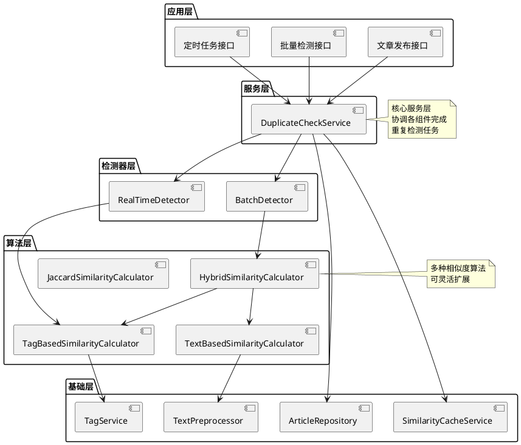

## 4. 核心模块设计

### 4.1 数据模型层

#### 4.1.1 Article（文章模型）

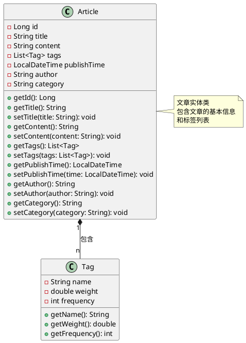

#### 4.1.2 SimilarityResult（相似度结果）

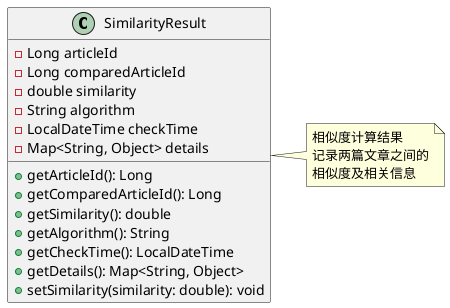

#### 4.1.3 DuplicateCheckConfig（检测配置）

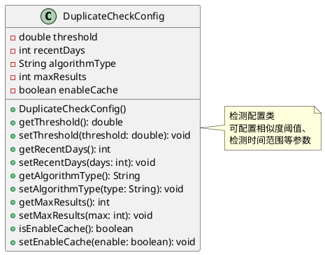

#### 4.1.4 DuplicateCheckReport（检测报告）

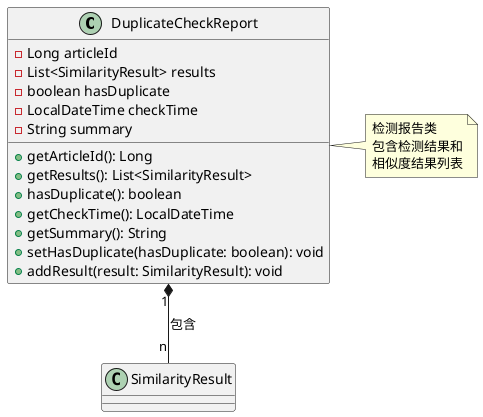

### 4.2 算法层

#### 4.2.1 SimilarityCalculator（相似度计算接口）

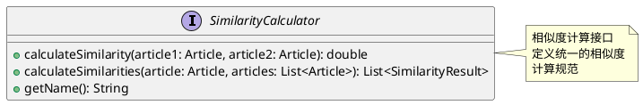

#### 4.2.2 算法实现类图

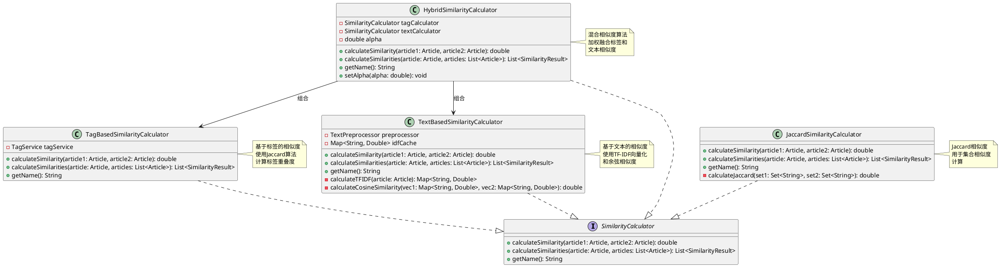

#### 4.2.3 算法特性对比

| 算法 | 原理 | 适用场景 | 优点 | 缺点 |
|-----|------|---------|------|------|
| TagBasedSimilarityCalculator | Jaccard相似度计算标签集合重叠 | 标签信息准确、主题明确的文章 | 计算快速、语义准确 | 依赖标签质量 |
| TextBasedSimilarityCalculator | TF-IDF向量化 + 余弦相似度 | 需要细粒度内容对比 | 考虑文本内容细节 | 计算复杂度较高 |
| HybridSimilarityCalculator | 加权融合标签和文本相似度 | 需要综合判断的场景 | 平衡准确性和效率 | 需要调整权重参数 |
| JaccardSimilarityCalculator | 集合相似度计算 | 通用集合相似度场景 | 算法简单、易于理解 | 仅适用于集合数据 |

### 4.3 服务层

#### 4.3.1 DuplicateCheckService（重复检测服务）

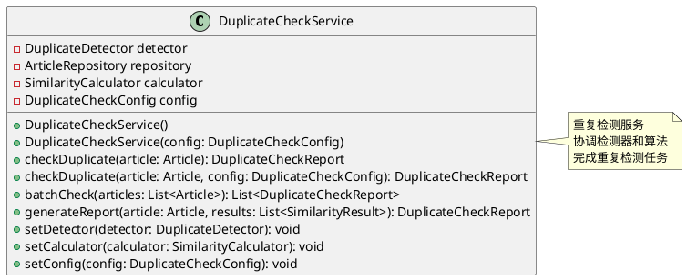

#### 4.3.2 ArticleRepository（文章仓储接口）

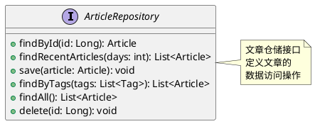

#### 4.3.3 SimilarityCacheService（缓存服务）

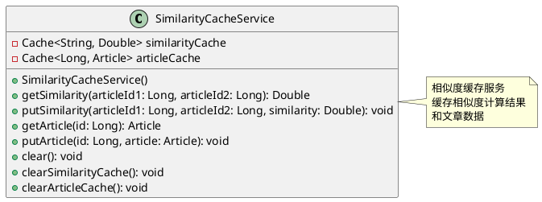

### 4.4 检测器层

#### 4.4.1 DuplicateDetector（检测器接口）

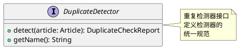

#### 4.4.2 检测器实现类图

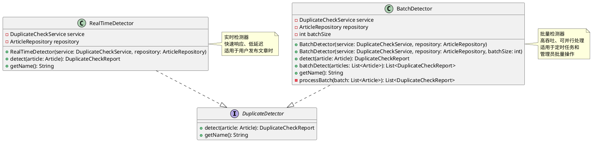

### 4.5 工具类层

#### 4.5.1 TextPreprocessor（文本预处理）

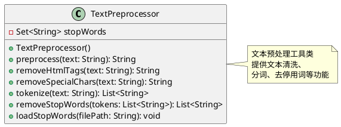

#### 4.5.2 SimilarityUtils（相似度工具类）

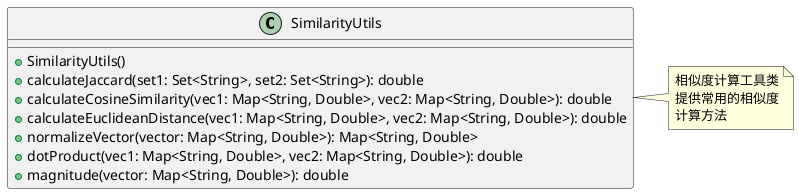

### 4.6 完整类图

```plantuml
@startuml
class Article {
  - Long id
  - String title
  - String content
  - List<Tag> tags
  - LocalDateTime publishTime
  - String author
  - String category
}

class Tag {
  - String name
  - double weight
  - int frequency
}

class SimilarityResult {
  - Long articleId
  - Long comparedArticleId
  - double similarity
  - String algorithm
  - LocalDateTime checkTime
  - Map<String, Object> details
}

class DuplicateCheckConfig {
  - double threshold
  - int recentDays
  - String algorithmType
  - int maxResults
  - boolean enableCache
}

class DuplicateCheckReport {
  - Long articleId
  - List<SimilarityResult> results
  - boolean hasDuplicate
  - LocalDateTime checkTime
  - String summary
}

interface SimilarityCalculator {
  + calculateSimilarity(article1: Article, article2: Article): double
  + calculateSimilarities(article: Article, articles: List<Article>): List<SimilarityResult>
  + getName(): String
}

class TagBasedSimilarityCalculator {
  - TagService tagService
}

class TextBasedSimilarityCalculator {
  - TextPreprocessor preprocessor
  - Map<String, Double> idfCache
}

class HybridSimilarityCalculator {
  - SimilarityCalculator tagCalculator
  - SimilarityCalculator textCalculator
  - double alpha
}

class JaccardSimilarityCalculator {
}

class DuplicateCheckService {
  - DuplicateDetector detector
  - ArticleRepository repository
  - SimilarityCalculator calculator
  - DuplicateCheckConfig config
}

interface ArticleRepository {
  + findById(id: Long): Article
  + findRecentArticles(days: int): List<Article>
  + save(article: Article): void
  + findByTags(tags: List<Tag>): List<Article>
}

class SimilarityCacheService {
  - Cache<String, Double> similarityCache
  - Cache<Long, Article> articleCache
}

interface DuplicateDetector {
  + detect(article: Article): DuplicateCheckReport
  + getName(): String
}

class RealTimeDetector {
  - DuplicateCheckService service
  - ArticleRepository repository
}

class BatchDetector {
  - DuplicateCheckService service
  - ArticleRepository repository
  - int batchSize
}

class TextPreprocessor {
  - Set<String> stopWords
}

class SimilarityUtils {
}

Article "1" *-- "n" Tag
DuplicateCheckReport "1" *-- "n" SimilarityResult

TagBasedSimilarityCalculator ..|> SimilarityCalculator
TextBasedSimilarityCalculator ..|> SimilarityCalculator
HybridSimilarityCalculator ..|> SimilarityCalculator
JaccardSimilarityCalculator ..|> SimilarityCalculator

HybridSimilarityCalculator --> TagBasedSimilarityCalculator
HybridSimilarityCalculator --> TextBasedSimilarityCalculator

RealTimeDetector ..|> DuplicateDetector
BatchDetector ..|> DuplicateDetector

DuplicateCheckService --> DuplicateDetector
DuplicateCheckService --> ArticleRepository
DuplicateCheckService --> SimilarityCalculator
DuplicateCheckService --> DuplicateCheckConfig

RealTimeDetector --> DuplicateCheckService
BatchDetector --> DuplicateCheckService

TextBasedSimilarityCalculator --> TextPreprocessor
TagBasedSimilarityCalculator --> TagService

DuplicateCheckService --> SimilarityCacheService
@enduml
```

## 5. 算法设计

### 5.1 基于标签的相似度算法

#### 5.1.1 算法流程图

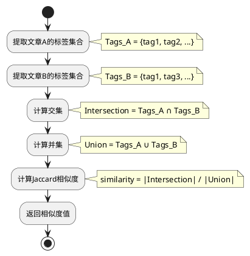

#### 5.1.2 算法对象图

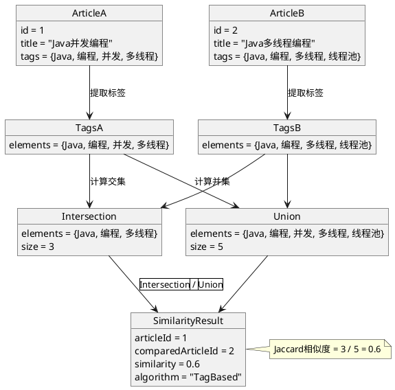

#### 5.1.3 优化策略
- 标签权重加权计算
- 考虑标签层级关系
- 同义词标签归一化

### 5.2 基于文本的相似度算法

#### 5.2.1 算法流程图

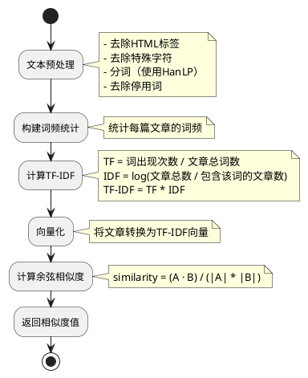

#### 5.2.2 算法对象图

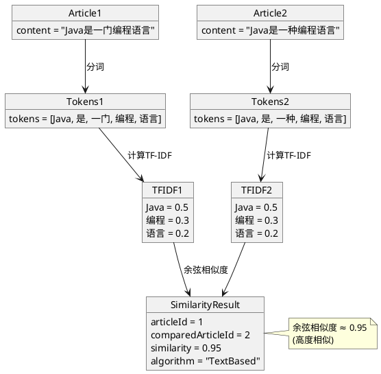

#### 5.2.3 优化策略
- 使用N-gram提升语义理解
- 词干提取和词形归一化
- 使用词向量（Word2Vec）增强语义理解

### 5.3 混合相似度算法

#### 5.3.1 算法流程图

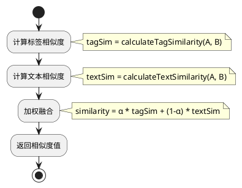

#### 5.3.2 算法对象图

```plantuml
@startuml
object ArticleA {
  id = 1
  title = "Java并发编程"
}

object ArticleB {
  id = 2
  title = "Java多线程编程"
}

object TagSimilarity {
  similarity = 0.6
  algorithm = "TagBased"
}

object TextSimilarity {
  similarity = 0.85
  algorithm = "TextBased"
}

object HybridCalculator {
  alpha = 0.6
}

object FinalResult {
  articleId = 1
  comparedArticleId = 2
  similarity = 0.69
  algorithm = "Hybrid"
}

ArticleA --> TagSimilarity : 计算标签相似度
ArticleB --> TagSimilarity
ArticleA --> TextSimilarity : 计算文本相似度
ArticleB --> TextSimilarity
TagSimilarity --> HybridCalculator : 输入
TextSimilarity --> HybridCalculator : 输入
HybridCalculator --> FinalResult : 加权融合

note right of FinalResult
  similarity = 0.6 * 0.6 + 0.4 * 0.85
             = 0.36 + 0.34
             = 0.70
end note
@enduml
```

#### 5.3.3 参数调优
- α默认值: 0.6（更重视标签相似度）
- 可根据业务场景调整权重
- 支持动态配置

### 5.4 相似度阈值设定

| 阈值范围 | 判定结果 | 建议操作 |
|---------|---------|---------|
| 0.0 - 0.3 | 不相似 | 正常发布 |
| 0.3 - 0.6 | 轻度相似 | 提示用户 |
| 0.6 - 0.8 | 中度相似 | 警告用户，要求确认 |
| 0.8 - 1.0 | 高度相似 | 阻止发布，要求修改 |

## 6. 接口设计

### 6.1 核心接口

#### 6.1.1 DuplicateCheckService接口

```plantuml
@startuml
interface DuplicateCheckService {
  + checkDuplicate(article: Article): DuplicateCheckReport
  + checkDuplicate(article: Article, config: DuplicateCheckConfig): DuplicateCheckReport
  + batchCheck(articles: List<Article>): List<DuplicateCheckReport>
  + generateReport(article: Article, results: List<SimilarityResult>): DuplicateCheckReport
  + setDetector(detector: DuplicateDetector): void
  + setCalculator(calculator: SimilarityCalculator): void
  + setConfig(config: DuplicateCheckConfig): void
}

note right of DuplicateCheckService
  核心服务接口
  提供单篇检测、批量检测
  和报告生成功能
end note
@enduml
```

#### 6.1.2 DuplicateDetector接口

```plantuml
@startuml
interface DuplicateDetector {
  + detect(article: Article): DuplicateCheckReport
  + getName(): String
}

note right of DuplicateDetector
  检测器接口
  定义检测器的
  标准行为
end note
@enduml
```

#### 6.1.3 SimilarityCalculator接口

```plantuml
@startuml
interface SimilarityCalculator {
  + calculateSimilarity(article1: Article, article2: Article): double
  + calculateSimilarities(article: Article, articles: List<Article>): List<SimilarityResult>
  + getName(): String
}

note right of SimilarityCalculator
  相似度计算接口
  定义相似度计算的
  标准方法
end note
@enduml
```

### 6.2 使用场景

#### 6.2.1 基本检测场景

```plantuml
@startuml
actor User
participant "DuplicateCheckService" as Service
participant "RealTimeDetector" as Detector
participant "TagBasedSimilarityCalculator" as Calculator
participant "ArticleRepository" as Repository

User -> Service: checkDuplicate(article)
Service -> Service: 初始化配置
Service -> Repository: findRecentArticles(days)
Repository --> Service: List<Article>
Service -> Detector: detect(article)
Detector -> Calculator: calculateSimilarities(article, articles)
Calculator --> Detector: List<SimilarityResult>
Detector --> Service: DuplicateCheckReport
Service --> User: DuplicateCheckReport

note right of Service
  使用默认配置
  进行单篇检测
end note
@enduml
```

#### 6.2.2 自定义配置检测场景

```plantuml
@startuml
actor User
participant "DuplicateCheckService" as Service
participant "DuplicateCheckConfig" as Config
participant "HybridSimilarityCalculator" as Calculator
participant "ArticleRepository" as Repository

User -> Config: 创建配置对象
User -> Config: setThreshold(0.85)
User -> Config: setRecentDays(15)
User -> Config: setAlgorithmType("hybrid")
User -> Config: setMaxResults(10)

User -> Service: checkDuplicate(article, config)
Service -> Config: 读取配置参数
Service -> Repository: findRecentArticles(15)
Repository --> Service: List<Article>
Service -> Calculator: calculateSimilarities(article, articles)
Calculator --> Service: List<SimilarityResult>
Service --> Service: 过滤相似度 > 0.85的结果
Service --> User: DuplicateCheckReport

note right of Config
  自定义配置:
  - 阈值: 0.85
  - 检测范围: 15天
  - 算法: hybrid
  - 最大结果: 10
end note
@enduml
```

#### 6.2.3 批量检测场景

```plantuml
@startuml
actor Admin
participant "DuplicateCheckService" as Service
participant "BatchDetector" as Detector
participant "TextBasedSimilarityCalculator" as Calculator
participant "ArticleRepository" as Repository

Admin -> Service: batchCheck(articles)
Service -> Service: 验证文章列表
Service -> Detector: batchDetect(articles)
loop 每批100篇
    Detector -> Repository: findRecentArticles(days)
    Repository --> Detector: List<Article>
    Detector -> Calculator: calculateSimilarities(article, articles)
    Calculator --> Detector: List<SimilarityResult>
    Detector -> Detector: 生成检测报告
end
Detector --> Service: List<DuplicateCheckReport>
Service --> Admin: List<DuplicateCheckReport>

note right of Detector
  批量处理策略:
  - 每批100篇
  - 并行计算
  - 分批返回结果
end note
@enduml
```

## 7. 性能优化

### 7.1 缓存策略

#### 7.1.1 缓存架构图

```plantuml
@startuml
package "缓存层" {
  component "SimilarityCacheService" as CacheService
}

package "应用层" {
  component "DuplicateCheckService" as Service
  component "SimilarityCalculator" as Calculator
}

package "数据层" {
  component "ArticleRepository" as Repository
}

Service --> CacheService : 查询/写入
Calculator --> CacheService : 查询/写入
CacheService --> Repository : 缓存未命中时查询

note right of CacheService
  缓存策略:
  - 相似度缓存: 24小时
  - 文章缓存: 1小时
  - 淘汰策略: LRU
  - 最大容量: 10000条
end note
@enduml
```

#### 7.1.2 缓存对象图

```plantuml
@startuml
object SimilarityCache {
  type = "LRU Cache"
  maxSize = 10000
  expireTime = "24h"
}

object ArticleCache {
  type = "LRU Cache"
  maxSize = 1000
  expireTime = "1h"
}

object CacheEntry1 {
  key = "1-2"
  value = 0.85
  timestamp = "2024-01-01 10:00:00"
}

object CacheEntry2 {
  key = "1"
  value = Article{id=1, title="Java"}
  timestamp = "2024-01-01 10:00:00"
}

SimilarityCache --> CacheEntry1 : 包含
ArticleCache --> CacheEntry2 : 包含

note right of SimilarityCache
  相似度缓存
  存储文章对的相似度
  计算结果
end note

note right of ArticleCache
  文章缓存
  存储近期文章数据
  减少数据库查询
end note
@enduml
```

### 7.2 批量处理优化

#### 7.2.1 并行计算流程图

```plantuml
@startuml
start
:获取目标文章;

:获取待对比文章列表;

:将文章列表分成批次;
note right: 每批100篇

:并行处理每批;
split
  :批次1: 并行计算相似度;
split again
  :批次2: 并行计算相似度;
split again
  :批次3: 并行计算相似度;
end split

:合并所有批次结果;

:按相似度排序;

:返回Top N结果;
stop
@enduml
```

#### 7.2.2 批量处理对象图

```plantuml
@startuml
object BatchProcessor {
  batchSize = 100
  parallelism = 4
}

object Batch1 {
  articles = [Article1, Article2, ..., Article100]
  status = "processing"
}

object Batch2 {
  articles = [Article101, Article102, ..., Article200]
  status = "waiting"
}

object Batch3 {
  articles = [Article201, Article202, ..., Article250]
  status = "waiting"
}

object Results {
  results = [SimilarityResult1, SimilarityResult2, ...]
  total = 250
}

BatchProcessor --> Batch1 : 处理
BatchProcessor --> Batch2 : 等待
BatchProcessor --> Batch3 : 等待
Batch1 --> Results : 生成结果
Batch2 --> Results : 生成结果
Batch3 --> Results : 生成结果

note right of BatchProcessor
  批量处理器
  - 批次大小: 100
  - 并行度: 4
  - 自动分批
end note
@enduml
```

### 7.3 算法优化

#### 7.3.1 早期终止优化

```plantuml
@startuml
start
:开始计算相似度;

:计算部分特征;

:检查当前相似度;
if (当前相似度 >= 阈值) then (是)
  :提前终止计算;
  :返回当前相似度;
else (否)
  :继续计算剩余特征;
  :完成计算;
  :返回最终相似度;
endif

stop

note right
  早期终止策略:
  当相似度超过阈值时
  立即终止计算
  减少不必要的计算
end note
@enduml
```

#### 7.3.2 预筛选优化

```plantuml
@startuml
start
:获取待对比文章列表;

:使用快速算法预筛选;
note right: 如标签相似度

:筛选候选文章;
note right: 相似度 > 预筛选阈值

if (候选文章数量 > 0) then (是)
  :使用精确算法计算;
  note right: 如文本相似度
  :返回精确结果;
else (否)
  :返回空结果;
endif

stop

note right
  预筛选策略:
  1. 快速算法筛选
  2. 精确算法计算
  3. 减少计算量
end note
@enduml
```

## 8. 测试方案

### 8.1 单元测试

#### 8.1.1 算法测试场景

```plantuml
@startuml
actor Tester
participant "TagBasedSimilarityCalculator" as TagCalc
participant "TextBasedSimilarityCalculator" as TextCalc
participant "Article" as Article

Tester -> Article: 创建测试文章1
Tester -> Article: 创建测试文章2

Tester -> TagCalc: calculateSimilarity(article1, article2)
TagCalc --> Tester: 返回相似度值
Tester -> Tester: 验证相似度 > 0.5

Tester -> TextCalc: calculateSimilarity(article1, article2)
TextCalc --> Tester: 返回相似度值
Tester -> Tester: 验证相似度 > 0.8

note right of TagCalc
  测试标签相似度算法
  验证Jaccard计算正确性
end note

note right of TextCalc
  测试文本相似度算法
  验证TF-IDF和余弦相似度
end note
@enduml
```

#### 8.1.2 服务测试场景

```plantuml
@startuml
actor Tester
participant "DuplicateCheckService" as Service
participant "DuplicateDetector" as Detector
participant "ArticleRepository" as Repository

Tester -> Service: 创建服务实例
Tester -> Service: 注入Mock依赖

Tester -> Repository: 设置测试数据
Repository --> Service: 返回测试文章

Tester -> Service: checkDuplicate(article)
Service -> Detector: detect(article)
Detector --> Service: 返回检测报告
Service --> Tester: 返回检测报告

Tester -> Tester: 验证报告不为空
Tester -> Tester: 验证结果列表不为空

note right of Service
  测试服务层功能
  验证检测流程完整性
end note
@enduml
```

### 8.2 集成测试

#### 8.2.1 完整流程测试

```plantuml
@startuml
actor Tester
participant "ArticlePublishService" as PublishService
participant "DuplicateCheckService" as CheckService
participant "ArticleRepository" as Repository

Tester -> Repository: 保存原始文章
Repository --> Tester: 返回文章ID

Tester -> PublishService: publishArticle(相似文章)
PublishService -> CheckService: checkDuplicate(article)
CheckService -> Repository: findRecentArticles(30)
Repository --> CheckService: 返回近期文章
CheckService -> CheckService: 计算相似度
CheckService --> PublishService: 返回检测报告

alt 检测到重复
  PublishService --> Tester: 抛出DuplicateArticleException
else 未检测到重复
  PublishService -> Repository: save(article)
  Repository --> Tester: 返回成功
end

note right of CheckService
  集成测试完整流程
  验证从发布到检测的
  整个业务流程
end note
@enduml
```

### 8.3 性能测试

#### 8.3.1 性能测试场景

```plantuml
@startuml
actor Tester
participant "PerformanceTest" as PerfTest
participant "DuplicateCheckService" as Service
participant "Timer" as Timer

Tester -> PerfTest: setup()
PerfTest -> Service: 初始化服务

Tester -> Timer: start()
Tester -> PerfTest: testSingleArticleCheck()
PerfTest -> Service: checkDuplicate(article)
Service --> PerfTest: 返回报告
PerfTest --> Timer: stop()
Timer --> Tester: 返回耗时

Tester -> PerfTest: 验证耗时 < 100ms

Tester -> Timer: start()
Tester -> PerfTest: testBatchCheck(100)
PerfTest -> Service: batchCheck(articles)
Service --> PerfTest: 返回报告列表
PerfTest --> Timer: stop()
Timer --> Tester: 返回耗时

Tester -> PerfTest: 验证耗时 < 10s

note right of PerfTest
  性能测试:
  - 单篇检测 < 100ms
  - 100篇检测 < 10s
  - 多次测试取平均值
end note
@enduml
```

## 9. 部署方案

### 9.1 依赖配置

#### 9.1.1 依赖关系图

```plantuml
@startuml
package "应用层" {
  component "DuplicateCheckService"
}

package "检测器层" {
  component "RealTimeDetector"
  component "BatchDetector"
}

package "算法层" {
  component "TagBasedSimilarityCalculator"
  component "TextBasedSimilarityCalculator"
  component "HybridSimilarityCalculator"
}

package "基础层" {
  component "TagService"
  component "ArticleRepository"
  component "SimilarityCacheService"
  component "TextPreprocessor"
}

package "外部依赖" {
  component "HanLP"
  component "IKAnalyzer"
  component "SLF4J"
  component "Caffeine"
  component "JUnit"
}

"DuplicateCheckService" --> "RealTimeDetector"
"DuplicateCheckService" --> "BatchDetector"
"DuplicateCheckService" --> "ArticleRepository"
"DuplicateCheckService" --> "SimilarityCacheService"

"RealTimeDetector" --> "TagBasedSimilarityCalculator"
"BatchDetector" --> "HybridSimilarityCalculator"

"TagBasedSimilarityCalculator" --> "TagService"
"TextBasedSimilarityCalculator" --> "TextPreprocessor"
"HybridSimilarityCalculator" --> "TagBasedSimilarityCalculator"
"HybridSimilarityCalculator" --> "TextBasedSimilarityCalculator"

"TagService" --> "HanLP"
"TagService" --> "IKAnalyzer"
"TextPreprocessor" --> "HanLP"

"DuplicateCheckService" --> "SLF4J"
"SimilarityCacheService" --> "Caffeine"

note right of "JUnit"
  测试依赖
  用于单元测试和
  集成测试
end note
@enduml
```

### 9.2 配置文件

#### 9.2.1 配置对象图

```plantuml
@startuml
object ApplicationConfig {
  duplicate.check.threshold = 0.8
  duplicate.check.recent.days = 30
  duplicate.check.algorithm = hybrid
  duplicate.check.max.results = 5
  duplicate.check.enable.cache = true
  cache.similarity.expire.hours = 24
  cache.article.expire.hours = 1
  cache.max.size = 10000
  batch.size = 100
  batch.parallelism = 4
}

object RuntimeConfig {
  threshold = 0.8
  recentDays = 30
  algorithmType = "hybrid"
  maxResults = 5
  enableCache = true
}

ApplicationConfig --> RuntimeConfig : 加载配置

note right of ApplicationConfig
  应用配置文件
  定义系统运行参数
  可动态调整
end note

note right of RuntimeConfig
  运行时配置对象
  从配置文件加载
  用于服务初始化
end note
@enduml
```

### 9.3 集成方式

#### 9.3.1 文章发布集成

```plantuml
@startuml
actor User
participant "ArticlePublishService" as PublishService
participant "DuplicateCheckService" as CheckService
participant "ArticleRepository" as Repository

User -> PublishService: publishArticle(article)
PublishService -> CheckService: checkDuplicate(article)
CheckService -> Repository: findRecentArticles(30)
Repository --> CheckService: List<Article>
CheckService -> CheckService: 计算相似度
CheckService --> PublishService: DuplicateCheckReport

alt hasDuplicate = true
  PublishService --> User: 抛出DuplicateArticleException
  note right: 阻止发布
else hasDuplicate = false
  PublishService -> Repository: save(article)
  Repository --> User: 发布成功
end

note right of PublishService
  在文章发布流程中
  集成重复检测功能
  确保内容不重复
end note
@enduml
```

#### 9.3.2 定时任务集成

```plantuml
@startuml
participant "Scheduler" as Scheduler
participant "DuplicateCheckService" as CheckService
participant "BatchDetector" as Detector
participant "ArticleRepository" as Repository

Scheduler -> Scheduler: 触发定时任务
note right: 每天凌晨2点执行

Scheduler -> Repository: findAll()
Repository --> Scheduler: List<Article>

Scheduler -> CheckService: batchCheck(articles)
CheckService -> Detector: batchDetect(articles)
loop 每批100篇
  Detector -> CheckService: checkDuplicate(article)
  CheckService --> Detector: DuplicateCheckReport
end
Detector --> Scheduler: List<DuplicateCheckReport>

Scheduler -> Scheduler: 生成报告
Scheduler -> Scheduler: 发送通知

note right of Scheduler
  定时扫描所有文章
  检测潜在重复内容
  生成报告并通知管理员
end note
@enduml
```

## 10. 实施计划

### 10.1 开发阶段

| 阶段 | 任务 | 工作量 |
|-----|------|--------|
| 第一阶段 | 数据模型设计 | 1天 |
| 第二阶段 | 算法实现（标签、文本、混合） | 3天 |
| 第三阶段 | 服务层和检测器实现 | 2天 |
| 第四阶段 | 缓存和性能优化 | 2天 |
| 第五阶段 | 单元测试 | 2天 |
| 第六阶段 | 集成测试和文档 | 1天 |

### 10.2 里程碑

```plantuml
@startuml
package "重复文章校验系统" {
  component "数据模型设计"
  component "算法实现"
  component "服务层实现"
  component "性能优化"
  component "测试"
  component "文档和部署"
}

"数据模型设计" --> "算法实现"
"算法实现" --> "服务层实现"
"服务层实现" --> "性能优化"
"性能优化" --> "测试"
"测试" --> "文档和部署"

note right of "数据模型设计"
  设计数据模型
  创建类图
end note

note right of "算法实现"
  实现标签相似度算法
  实现文本相似度算法
  实现混合相似度算法
end note

note right of "服务层实现"
  实现检测服务
  实现检测器
  实现仓储接口
end note

note right of "性能优化"
  实现缓存服务
  优化批量处理
  优化算法性能
end note

note right of "测试"
  编写单元测试
  编写集成测试
  性能测试
end note

note right of "文档和部署"
  完善文档
  部署上线
end note

note bottom of "文档和部署"
  总计: 11个工作日
  6个主要阶段
  5个关键里程碑
end note
@enduml
```

### 10.3 后续优化

- 引入深度学习模型提升相似度计算准确性
- 支持图片、视频等多媒体内容检测
- 实现实时流式检测
- 添加可视化分析报表
- 支持跨语言文章检测

## 11. 风险评估

### 11.1 技术风险

| 风险 | 影响 | 概率 | 应对措施 |
|-----|------|------|---------|
| 相似度算法准确度不足 | 高 | 中 | 多算法融合，持续优化 |
| 性能不达标 | 中 | 低 | 缓存优化、并行计算 |
| 标签质量差 | 中 | 中 | 提升标签提取准确性 |

### 11.2 业务风险

| 风险 | 影响 | 概率 | 应对措施 |
|-----|------|------|---------|
| 误判正常文章 | 中 | 低 | 调整阈值、人工审核 |
| 漏判重复文章 | 高 | 低 | 多重检测、定期扫描 |

## 12. 附录

### 12.1 术语表

| 术语 | 说明 |
|-----|------|
| Jaccard相似度 | 用于计算两个集合相似度的指标 |
| TF-IDF | 词频-逆文档频率，用于文本特征提取 |
| 余弦相似度 | 用于计算两个向量相似度的指标 |
| 标签权重 | 标签的重要性程度 |

### 12.2 参考资料

- HanLP文档: https://hanlp.hankcs.com/
- TF-IDF算法详解
- 文本相似度计算方法综述
